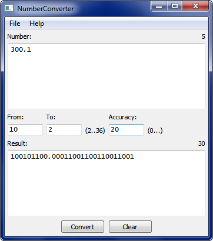
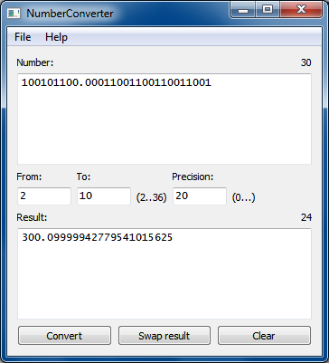
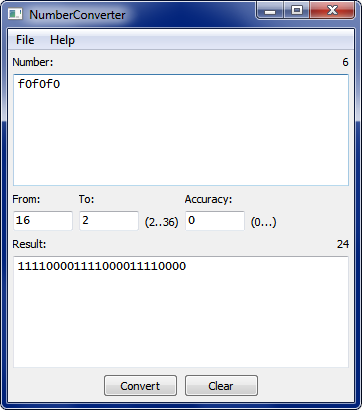
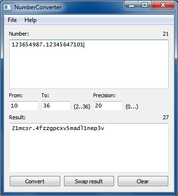

# NumberConverter
Convert integers and fixed point reals between numeral systems. Supports numeral systems form 2 to 36. Alphabet is '0-9a-z\.'. Input strings are case insensitive. Parsing of input string stops when meets wrong character in a given system and shows you an error message. Length of numbers is limited olny by your available memory as the program depends on Boost multiprecision integers (MPI).

The program is written in C++17 and depends on Boost for MPIs and Qt for interface.

## Pseudocode
### Core procedure
Input: 
- inputNumber - string, a number in system base1. inputNumber can contain integer part, decimal point and fraction part;
- base1 - integer, numeral system of input number;
- base2 - integer, numeral system of output number;
- digitsAfterPoint - integer to limit length of a faction part in an output number.

Output:
- outString - string, inputNumber in base2. If inputNumber contains fraction part, outString can also contains one.  Some numbers in system base1 don't have precise representation in system base2.

```
1. Split inputNumber into intPartStr - part to left of the point, 
   and fractPartStr - part to right of the point.
2. Put intPart := toInteger(intPartStr) - MPI, intPartStr as number.
3. Put fractPart := {toInteger(fractPartStr), pow(base1, fractPartStr.size)} - 
   rational number consists of MPIs {numerator, denominator} and
   represens fractPartStr as number from [0, 1).
4. Put outString := toString(intPart).
5. If fractPart > 0 and digitsAfterPoint > 0:
5.1. Assign outString += "." + fractionPartToString(fractPart).
6. Return outString.
```

### Procedure toInteger
Input: 
- inputNumber - string form of a MPI in system base1.

Output:
- ret - MPI form of inputNumber.

Variables:
- digits - vector of chars 0,..,9,a,..,z, where item's index from the beginning denotes numeral value of this symbolic digit. Indicies are 0-based.

```
1. Put MPIs ret := 0.
2. For every char c in inputNumber from begin to end do:
2.1. Put d := index of c in vector digits.
2.2. Assign ret := ret * base1 + d.
3. Return num.
```

### Procedure pow
Input: 
- a - MPI;
- n - integer number.

Output:
- a, raised to power n.

Use boost::multiprecision::pow(MPI, unsigned).

### Procedure toString
Input: 
- inputNumber - MPI.

Output:
- outStr - string form of inputNumber in system base2.

Variables:
- digits - vector of chars 0,..,9,a,..,z, as above.

```
1. Put outStr := "".
2. If inputNumber = 0:
2.1. Return "0".
2. While inputNumber > 0 do:
2.1. Divide inputNumber by base2 and get numbers:
     r - unsigned, remainder;
     q - MPI, quotient.
2.2. Assign outStr += digits[r].
2.3. Assign inputNumber := q.
3. Reverse chars in outStr.
4. Return outStr.
```

### Procedure fractionPartToString
Input: 
- num - rational number in range \[0, 1\).

Output:
- outStr - string form of num in system base2.

Variables:
- digitsAfterPoint - max number of digits after point, as above.
- digits - vector of chars 0,..,9,a,..,z, as above.

```
1. Put outStr := "".
2. For i in [0, digitsAfterPoint) do:
2.1. Assign num := fract(num) * base2.
2.2. If num = 0, break loop 2.
2.3. Assign num2 := floor(num).
2.4. Assign outStr += digits[num2].
3. Return outStr.
```

### Procedure fract
Input: 
- num - rational number in range.

Output:
- num2 - rational number, fractional part of num.

```
Return num - floor(num);
```

### Procedure floor
Input: 
- num - rational number in range.

Output:
- num2 - MPI derived from rounding num to nearest integer towards minus inf.

```
1. Put num2 := numerator(num) / denominator(num).
2. If num2 > num:
2.1 Decrement --num2.
3. Return num2.
```

More details in [this](NumberConverter.cpp) file.

## Examples




